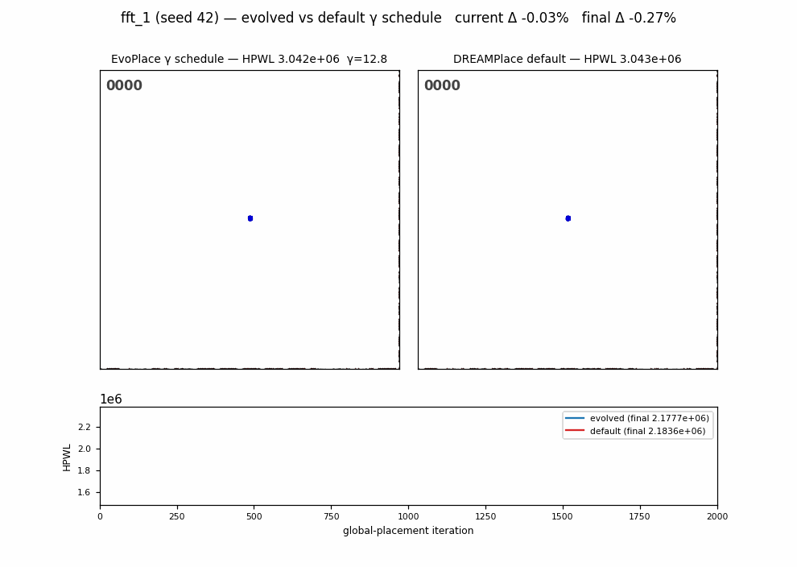
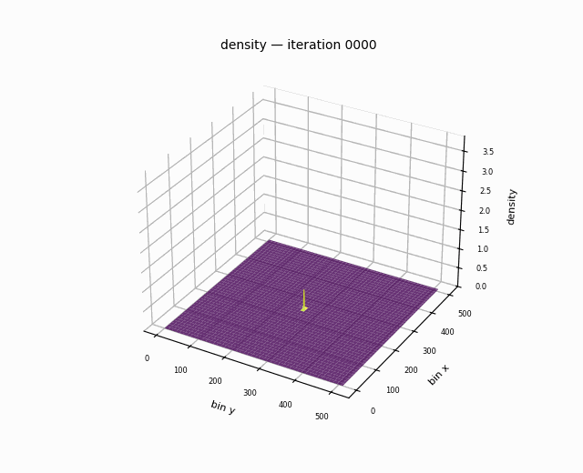
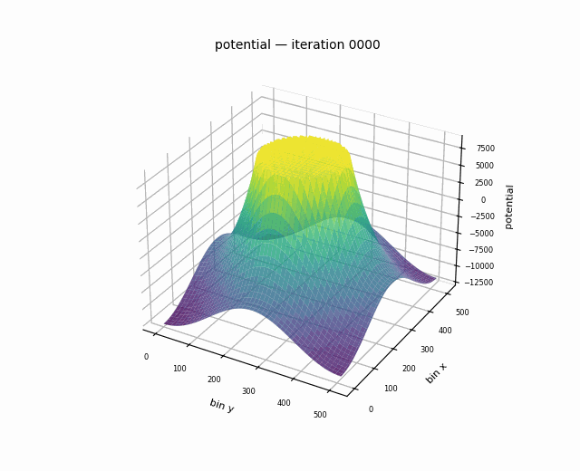
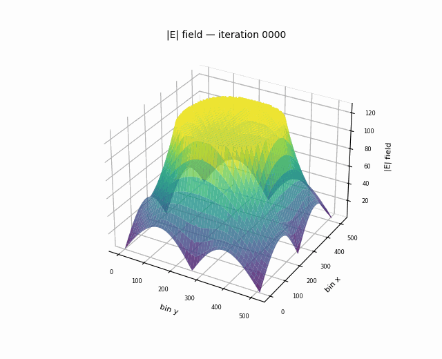
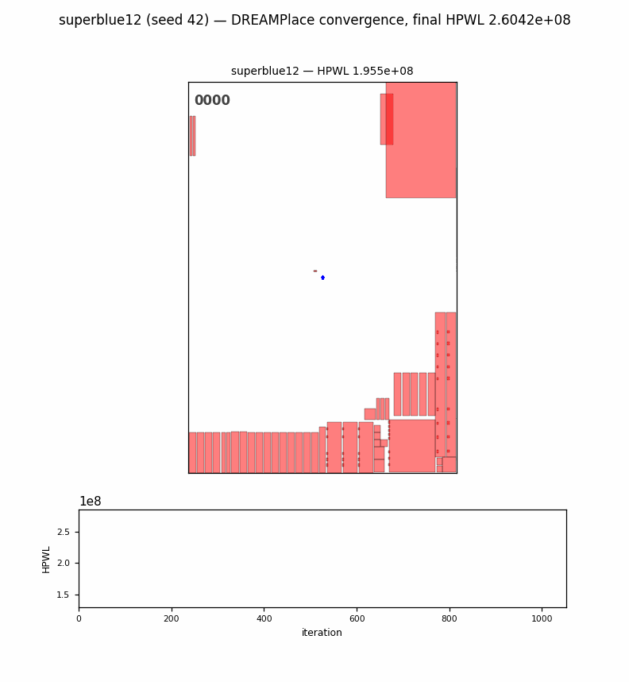
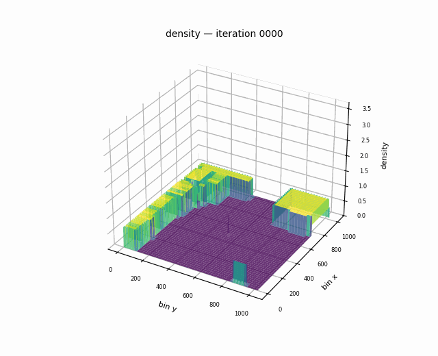

# EvoPlace: LLM-Guided Evolutionary VLSI Placement

> **Status**: Research concluded (June 2026) &nbsp;|&nbsp; **Paper**: [paper/paper.pdf](paper/paper.pdf) &nbsp;|&nbsp; **Python**: 3.10+ &nbsp;|&nbsp; **Framework**: DREAMPlace 4.0

EvoPlace is a research system that applies LLM-guided evolutionary search to automatically discover better algorithmic components for differentiable VLSI placement.

## The result, up front

**The evolved schedules ended up only marginally better than DREAMPlace's defaults — +0.315% ± 0.09% HPWL at best — so if you're here for a faster/better placer, this isn't it.** What this repo *is*: a complete, honestly-documented research campaign with some findings we think are worth your time anyway:

- **A rank inversion that should worry the field**: the best candidate by single-seed score turned out to be pure seed luck under multi-seed re-evaluation, while the runner-up was the real (tiny) improvement. Nearly all published placement gains are single-seed. ([paper](paper/paper.pdf))
- **A noise-calibrated evaluation protocol** — measured noise floor, hook-liveness gates, paired multi-seed confirmation with a calibration row — that catches both dead code paths and noise-fitting before they reach a results table.
- **A clean injection harness**: evolve placement schedule functions as pure Python, no rebuilds, with cascade evaluation that rejects bad candidates at 13× lower cost.
- **The full story in [NOTES.md](NOTES.md)** — including the dead-hook fiasco, the data-provenance bug we caught in our own results, and an adversarially-verified literature review ([RESEARCH.md](RESEARCH.md)) of what actually moves placement QoR.
- Some genuinely fun [visualizations](#evolved-vs-default-γ-schedule--fft_1-ispd-2015) of the e-place physics.

---

### Evolved vs. default γ schedule — `fft_1` (ISPD 2015)

The best evolved schedule from Exp 1 (`candidate_0117`, overflow-driven
exponential γ with a progress envelope) racing the DREAMPlace default on the
same seed, with live HPWL underneath. Multi-seed paired result: **+0.315% ±
0.09% (SEM)** — statistically real, practically tiny; the campaign's boundary
result (see [NOTES.md](NOTES.md)).



### Electrostatics in motion — `fft_1`

Bin-level views of the e-place physics during the same run: cell density
flattening as cells spread, the electric potential that drives them, and the
field magnitude.

| Density | Potential | Field magnitude |
|:---:|:---:|:---:|
|  |  |  |

### Large-design showcase — `superblue12` (1.3M cells)

Full convergence of DREAMPlace's default flow on superblue12, cells rendered
as density scatter (128 GB unified memory holds the whole design resident).





---

## Key Design Decisions

**Noise-calibrated evaluation, always.** The single-seed fitness noise floor (σ ≈ 0.15% normalized HPWL) was measured before the campaign; no single-seed improvement below 3σ is treated as a result; every campaign ends with paired multi-seed re-ranking in which the seed program rides along as a calibration row. This protocol is the project's main methodological takeaway.

**Hook-liveness gates before every campaign.** An earlier CPU-era run silently evaluated vanilla DREAMPlace for every candidate (the hooks weren't wired in) — 20 "candidates" whose score spread was pure numerical noise. Now: the seed must reproduce the default at norm 1.0 ± 0.01, and a deliberately degenerate schedule must score very differently, before any evolution starts.

**Algorithm evolution, not hyperparameter tuning.** AutoDMP (NVIDIA, ISPD 2023) applied Bayesian optimization over DREAMPlace's scalar hyperparameters. EvoPlace searches over the functional form of schedule components — a strictly larger space. (The campaign's conclusion: for *schedules* specifically, that larger space contains almost nothing the default doesn't already capture.)

**No RL.** Google's AlphaChip (Nature 2021) used RL macro placement; independent evaluations (Cheng et al. ISPD 2023, Markov arXiv:2306.09633) showed its gains traced largely to undisclosed initialization, with simulated annealing outperforming it at a fraction of the compute. EvoPlace uses analytical global placement as its backbone.

**Stability boundary between fixed and editable code.** `evaluator/run_placement.py` and `autoresearch/evaluate.py` are never modified during experiments. This prevents fitness-function drift and enables reproducible comparisons across evolution runs.

**TNS was the original fitness target, HPWL the actual one.** The founding pitch targeted post-route timing (HPWL↔TNS rank correlation is ρ < 0.28, ChiPBench 2024), but ISPD 2015 lacks timing constraints and the GPU timing engine ships x86-only — so the campaign ran on HPWL fitness. The timing hooks (`timing_loss`, path-group net weights) are built and tested, but unexercised at scale.

---

## Motivation

DREAMPlace (DAC 2019, ICCAD 2020) achieved a landmark 40× speedup by casting VLSI placement as GPU-accelerated differentiable optimization. Its successors remain the state of the art. But three structural weaknesses limit their usefulness for modern timing-closure flows:

| Weakness | Evidence |
|---|---|
| **Wrong metric** | HPWL has rank correlation ρ < 0.28 with post-route TNS (ChiPBench 2024) |
| **Heuristic schedules** | γ (WA-WL smoothness) and λ (density weight) are hand-tuned constants |
| **No timing awareness** | DREAMPlace 4.0 adds net weighting but still minimizes HPWL end-to-end |

ChiPBench (2024) confirms that AI-based placers "perform poorly in end-to-end PPA metrics compared to OpenROAD, particularly in TNS." EvoPlace set out to address this gap; the campaign's measured answer for the schedule component is in the [paper](paper/paper.pdf).

---

## Approach

We treat each placement algorithm component as a Python function and evolve it using an LLM ensemble:

```
DREAMPlace 4.0 backbone
├── γ(t, overflow, history)  ← Exp 1: evolved by OpenEvolve / Claude Code CLI
├── λ(t, overflow, history)  ← Exp 2: evolved by OpenEvolve / Claude Code CLI
├── init(netlist) → (x, y)   ← Exp 3: GNN warm initializer
└── L_timing(placement)      ← Exp 4: differentiable TNS surrogate
```

**Why evolutionary code search over hyperparameter tuning?** Bayesian optimization (AutoDMP, ISPD 2023) tunes scalars in a fixed functional form. We search over the *functional form itself* — the schedule shape, adaptive logic, and interaction with overflow — which is a strictly larger space.

**Why Claude Code CLI over a raw API key?** `claude -p` is available in any authenticated Claude Code session. No separate key management, same model quality, zero additional cost.

---

## Experiments

| # | Name | Method | Primary Metric | Outcome |
|---|------|--------|----------------|---------|
| 0 | DREAMPlace Baseline | Reproduction | HPWL | ✅ Done — re-measured per machine (table below) |
| 1 | WL Smoothing Schedule | Evolve γ(t), 200 iters | HPWL ↓ | ✅ **Done — boundary result: best real gain +0.315% ± 0.09%; single-seed winner was noise** |
| 2 | Density Weight Schedule | Evolve λ(t) | Divergence ↓ | ❌ Not run — Exp 1's bound and the [literature review](RESEARCH.md) closed the schedule direction |
| 3 | GNN Warm Initialization | Heterogeneous GNN | Iters to converge ↓ | ❌ Not run — models built and unit-tested only |
| 4 | Differentiable TNS Surrogate | MLP loss term | TNS ↓ | ❌ Not run — hooks built; blocked by benchmark/timer constraints |
| 5 | Full System | Best of 1–4 | HPWL + TNS | ❌ Superseded by the boundary result |

Exp 1 in one figure: 200 candidates, 93% cascade-rejected, every apparent improvement inside the single-seed noise band, one survivor confirmed real by paired multi-seed re-ranking — see Figs. 1–2 of the [paper](paper/paper.pdf).

### Exp 0 Baselines (converged, legalized, seed 42)

| Circuit | GB10 (DGX Spark, CUDA 13.0) | RTX 3060 (CUDA 12.6) |
|---------|------------------------------|----------------------|
| `fft_1` | 2.183 × 10⁶ (5.5 s) | 2.180 × 10⁶ (29.4 s) |
| `fft_2` | 1.951 × 10⁶ (2.2 s) | 1.921 × 10⁶ (12.2 s) |

Stage-matched cascade baselines (50 / 300 / full iterations, used by
`evolve/evaluator_wrapper.py`) are re-measured per machine — truncated runs
land ~2–2.5× above converged HPWL, so early cascade stages must normalize
against same-budget baselines.

---

## Repository Structure

```
evoplace/
├── paper/                  # The paper (LaTeX + PDF + figure scripts)
├── evaluator/              # Stable evaluation harness (never modified during experiments)
│   ├── run_placement.py    # DREAMPlace runner — cascade evaluation, stub fallback
│   ├── metrics.py          # HPWL, overflow, TNS proxy computation
│   └── benchmark_suite.py  # ISPD 2015 / ICCAD 2015 / small suite definitions
│
├── dreamplace_ext/         # DREAMPlace hook injection layer
│   ├── hooks.py            # γ, λ, init_positions, timing_loss hook singletons
│   ├── schedulers.py       # Baseline schedulers (linear, exponential, overflow-adaptive)
│   └── custom_objectives.py
│
├── evolve/                 # LLM-guided evolutionary search
│   ├── run_evolution.py    # CLI entry point; multi-backend LLM (CC CLI / API)
│   ├── evaluator_wrapper.py # Bridges OpenEvolve ↔ DREAMPlace cascade evaluator
│   ├── initial_program.py  # Seed γ schedule (reproduces DREAMPlace default)
│   └── config.yaml         # MAP-Elites settings, cascade thresholds
│
├── autoresearch/           # Karpathy-style autonomous experiment loop
├── models/                 # PyTorch neural components (unit-tested, unexercised at scale)
├── experiments/            # Per-experiment configs, results, logs
├── graphs/                 # Generated figures and animation GIFs
├── benchmarks/             # ISPD 2015 / ICCAD 2015 circuits (not committed — see SETUP.md)
├── vendor/dreamplace/      # DREAMPlace fork (submodule, branch evoplace-hooks)
├── scripts/                # multiseed_rerank.py, make_comparison_gif.py
├── NOTES.md                # The complete research journal
├── RESEARCH.md             # Adversarially-verified literature review
└── PAPER_DRAFT.md          # Early draft notes (superseded by paper/)
```

---

## Setup & Running

- **[SETUP.md](SETUP.md)** — requirements, GPU/WSL2 setup, DREAMPlace build, benchmark download. DGX Spark (aarch64/CUDA 13): [SPARK_SETUP.md](SPARK_SETUP.md).
- **[RUNNING.md](RUNNING.md)** — sanity gates, experiments, multi-seed re-ranking, visualizations, tests, paper build.

---

## Architecture Notes

### Evaluation Harness

`evaluator/run_placement.py` is the **fixed** evaluation contract — it is never modified during experiments. All algorithm components are injected as callables via `dreamplace_ext/hooks.py`:

```python
from evaluator.run_placement import run_placement

result = run_placement(
    benchmark_dir=Path("benchmarks/fft_1"),
    output_dir=Path("experiments/exp01/run_001"),
    gamma_schedule_fn=my_gamma_fn,   # inject evolved schedule
    max_iterations=2000,
)
print(result.metrics)  # {"hpwl": ..., "mean_overflow": ..., "tns_proxy": ...}
```

### Cascade Evaluation

To avoid spending full placement time on bad candidates, evolution uses three-stage cascade filtering (GPU mode):

```
Stage 0 (50 iters)  → reject if HPWL > 2.0 × the 50-iter baseline
Stage 1 (300 iters) → reject if HPWL > 1.3 × the 300-iter baseline
Stage 2 (full)      → complete placement; record all metrics
```

Each stage normalizes against a baseline measured at the *same* iteration
budget (see Exp 0). Normalizing truncated runs against the converged
baseline would cull every candidate — including the default schedule, which
lands at ~2.3× its converged HPWL after 50 iterations.

### Evolved Function Contract

The γ schedule function signature is fixed and must be preserved:

```python
def gamma_schedule(
    iteration: int,          # current step (0 to total_iterations-1)
    total_iterations: int,   # total planned steps
    overflow: float,         # current density overflow ∈ [0, 1]
    hpwl_history: list,      # HPWL values at previous iterations
) -> float:                  # γ ∈ [0.01, 20.0]
```

The evolution engine mutates only the function body. No new imports, no I/O, no external state.

---

## Hardware

The final campaign ran on an **NVIDIA DGX Spark** (GB10 Grace-Blackwell, aarch64, compute capability 12.1, 20 cores, 121 GiB unified memory, CUDA 13.0). Earlier development used an RTX 3060 (WSL2) and CPU-only stub mode. General guidance:

| Workload | Minimum | Notes |
|----------|---------|-------|
| Development + stub mode | Any CPU | Full pipeline testable without GPU |
| Evolution campaign (fft-class circuits) | 1× GPU ≥ 12 GB | ~90 min for 200 iterations on GB10 |
| superblue-class circuits | ≥ 24 GB (unified memory ideal) | 1.3M cells resident |

---

## Paper

**"How Much Headroom Do Smoothing Schedules Have? A Noise-Calibrated Study of LLM-Evolved Schedules in Differentiable VLSI Placement"**
— [paper/paper.pdf](paper/paper.pdf) (LaTeX source and figure scripts in [paper/](paper/); build with `cd paper && make`).

```bibtex
@misc{talasila2026headroom,
  title  = {How Much Headroom Do Smoothing Schedules Have? A Noise-Calibrated
            Study of {LLM}-Evolved Schedules in Differentiable {VLSI} Placement},
  author = {Talasila, Chaithu},
  year   = {2026},
  note   = {\url{https://github.com/themoddedcube/evoplace}}
}
```

---

## Related Work

| Paper | Venue | Relevance |
|-------|-------|-----------|
| DREAMPlace — Lin et al. | DAC 2019 / TCAD | Backbone placer |
| EvoPlace — Yao et al. (independent, same name) | arXiv:2504.17801 | LLM-evolved init/preconditioner/optimizer; init dominates; our schedule bound corroborates their component ordering |
| VeoPlace ("See it to Place it") | arXiv:2603.28733 | VLM-guided macro placement; rare multi-seed reporting |
| AutoDMP — Agnesina et al. | ISPD 2023 | Bayesian hyperparameter tuning over DREAMPlace |
| ChiPBench — He et al. | arXiv 2024 | HPWL/TNS correlation analysis motivating this work |
| AlphaChip reassessments — Cheng et al.; Markov | ISPD 2023; arXiv:2306.09633 | Single-seed/weak-baseline hazards in ML-for-EDA evaluation |
| OpenEvolve | arXiv 2025 | LLM-guided evolutionary code search (our evolution engine) |
